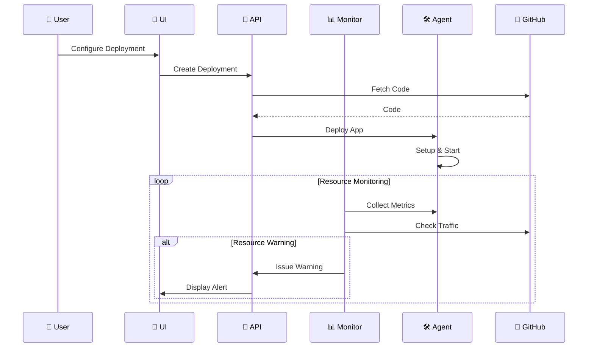
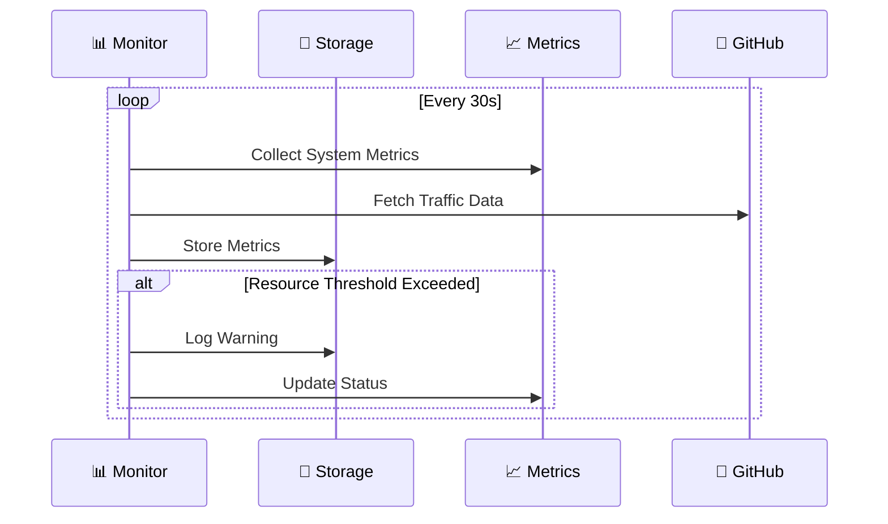

# 🏗️ NodeRoll Self-Hosted Architecture

> 🎯 Simple and efficient single-server deployment platform

## 🎯 Overview

NodeRoll Self-Hosted Standalone is designed for simplicity and efficiency, running on a single server with three core components:

| Component | Description | Port |
|-----------|-------------|------|
| 🚀 **API Server** | Business logic & deployment operations | 3000 |
| 🎨 **UI Server** | Web interface | 3001 |
| 🛠️ **System Agent** | Resource monitoring & management | - |

## 🧩 System Components

### 1. 🚀 API Server
The core engine of NodeRoll, handling deployments and system operations.

#### Key Features
- 🔐 GitHub OAuth integration
- 📦 Repository management
- 🚀 Deployment orchestration
- 📊 Resource monitoring
- 🔄 Smart resource management
- ⚡ Real-time updates

#### Technologies
- ⚙️ Node.js & Express
- 💾 SQLite with Sequelize
- 🔑 JWT auth
- 🔌 WebSocket
- 🐙 GitHub API integration

#### Services
- 📊 MonitoringService
  - System resource metrics (CPU, Memory)
  - GitHub traffic monitoring
  - Health checks
- 🔄 AutoScalingService
  - Resource-based scaling
  - Traffic-based adjustments
  - Cooldown management
- 🚀 DeploymentService
  - Process management
  - Configuration handling
  - Application state management

#### Data Storage
- 📁 Single SQLite database
- 🔄 Automatic backups
- 🔒 File-based security
- ⚡ Optimized for single-server

### 2. 🎨 UI Server
Clean and intuitive interface for developers.

#### Features
- 🎯 Minimalist design
- ⚡ Real-time updates
- 🌓 Dark/Light modes
- 📱 Responsive layout
- 📊 Resource visualization

#### Technologies
- ⚛️ React
- 🎨 Tailwind CSS
- 🔌 WebSocket client
- 📊 Chart.js

### 3. 🛠️ System Agent
Efficient system resource manager.

#### Responsibilities
- 📦 Process management (PM2)
- 🔄 Nginx configuration
- 🔒 SSL management
- 📊 Resource monitoring
- 🔄 Application scaling

## 🔄 System Flows

### Deployment Flow

### Resource Management Flow

## 🔒 Security

### Authentication
- 🔑 GitHub OAuth
- 🎟️ JWT tokens
- 🔐 Secure sessions

### Data Security
- 📁 File-level permissions
- 🔒 SQLite encryption
- 🔑 Access control

### Network Security
- 🛡️ HTTPS only
- 🔒 SSL/TLS
- 🚫 Rate limiting

## 📊 Resource Monitoring

### System Metrics
- 📈 CPU usage
- 💾 Memory utilization
- 💿 Disk space
- 🌐 Network traffic

### GitHub Metrics
- 🌐 Repository traffic
- 👥 Visitor count
- 📊 Clone statistics

### Warning System
- 📈 Resource thresholds
- ⚠️ Usage warnings
- 📊 Trend analysis

### Logging
- 📝 System logs
- 🎯 Performance tracking
- ⚡ Resource metrics

## 💾 Backup & Recovery

### Automated Backups
- 📁 Regular SQLite backups
- 🔄 Configuration backups
- 📊 Metric history

### Recovery
- ⚡ Quick restore
- 🔄 Configuration recovery
- 🛡️ Data verification
