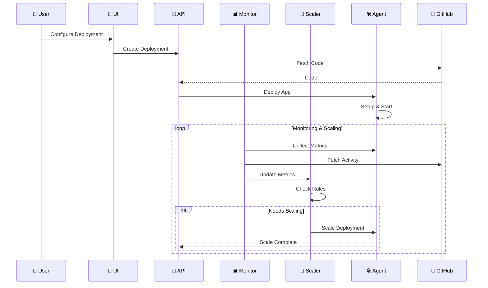
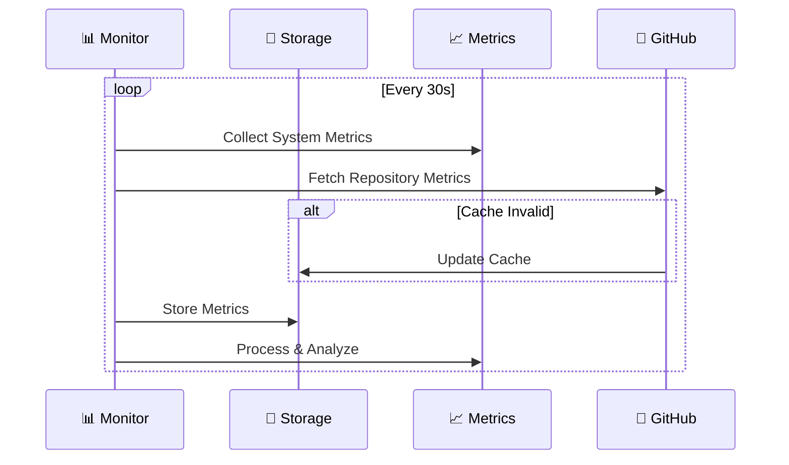

# 🏗️ NodeRoll Architecture

> 🎯 Simple yet powerful single-server deployment platform

## 🎯 Overview

NodeRoll Self-Hosted Standalone runs on a single server with three core components:

| Component | Description | Port |
|-----------|-------------|------|
| 🚀 **API Server** | Business logic & data operations | 3000 |
| 🎨 **UI Server** | Web interface | 3001 |
| 🛠️ **System Agent** | Server operations |  |

## 🧩 System Components

### 1. 🚀 API Server
The brain of NodeRoll, orchestrating all operations.

#### Key Features
- 🔐 GitHub OAuth integration
- 📦 Repository management
- 🚀 Deployment coordination
- 📊 Advanced monitoring
- 🔄 Intelligent auto-scaling
- ⚡ Real-time updates

#### Technologies
- ⚙️ Node.js & Express
- 💾 SQLite with Sequelize
- 🔑 JWT auth
- 🔌 WebSocket
- 🐙 GitHub API integration

#### Services
- 📊 MonitoringService
  - System metrics collection
  - GitHub activity tracking
  - Health checks
- 🔄 AutoScalingService
  - Rule-based scaling
  - Activity-based scaling
  - Cooldown management
- 🚀 DeploymentService
  - Process management
  - Configuration handling
  - State management

#### Data Storage
- 📁 Single SQLite file
- 🔄 Automatic backups
- 🔒 File-based security
- ⚡ Fast operations
- 📊 Metrics history

### 2. 🎨 UI Server
Beautiful and intuitive interface for developers.

#### Features
- 🎯 Clean design
- ⚡ Real-time updates
- 🌓 Dark/Light modes
- 📱 Responsive layout
- 📊 Advanced metrics visualization

#### Technologies
- ⚛️ React
- 🎨 Tailwind CSS
- 🔌 WebSocket client
- 📊 Chart.js
- 📈 D3.js for complex metrics

### 3. 🛠️ System Agent
Powerful system-level operations manager.

#### Responsibilities
- 📦 Process management (PM2)
- 🔄 Nginx configuration
- 🔒 SSL management
- 📊 Metrics collection
- 🔄 Container orchestration

## 🔄 System Flows

### Deployment & Scaling Flow

### Monitoring Data Flow

## 🔒 Security

### Authentication
- 🔑 GitHub OAuth
- 🎟️ JWT tokens
- 🔐 Secure sessions
- 🔒 API key management

### Data Security
- 📁 File-level permissions
- 🔒 SQLite encryption
- 🔑 Access control
- 🔐 Metric data protection

### Network Security
- 🛡️ HTTPS only
- 🔒 SSL/TLS
- 🚫 Rate limiting
- 🔒 WebSocket security

## 📊 Advanced Monitoring

### System Metrics
- 📈 CPU & Memory usage
- 💾 Disk utilization
- 🌐 Network traffic
- 🚦 Process health

### GitHub Metrics
- 📊 Commit frequency
- 🔄 PR activity
- 📈 Issue tracking
- 🌐 Repository traffic

### Auto-Scaling Metrics
- 📈 Scaling events
- ⏱️ Cooldown periods
- 📊 Rule triggers
- 🎯 Performance impact

### Logging & Analytics
- 📝 Structured logs
- 🎯 Query tracing
- ⚡ Performance metrics
- 📊 Scaling analytics

## 💾 Backup & Recovery

### Automated Backups
- 📁 Daily SQLite backups
- 🔄 Configuration backups
- 📦 Application state
- 📊 Metric history

### Recovery Process
- ⚡ Quick restore
- 🔄 Point-in-time recovery
- 🛡️ Data integrity checks
- 📈 Metric preservation

---

📚 [Back to Documentation](../README.md)

