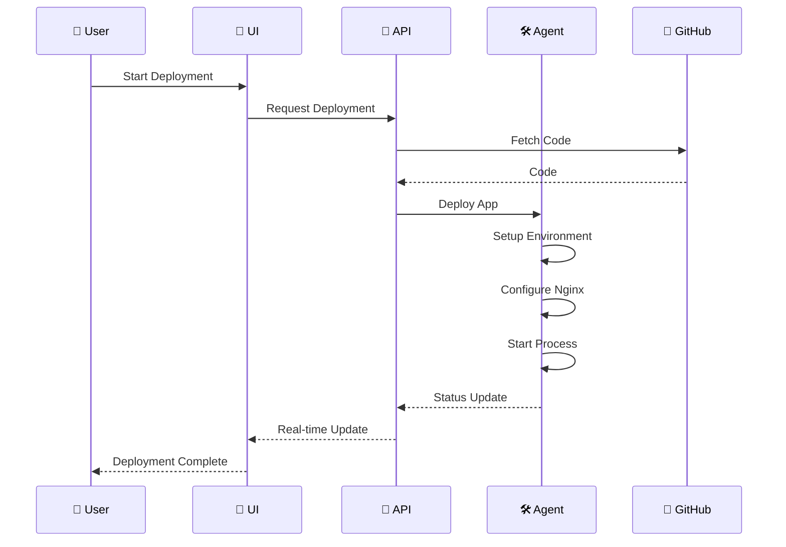
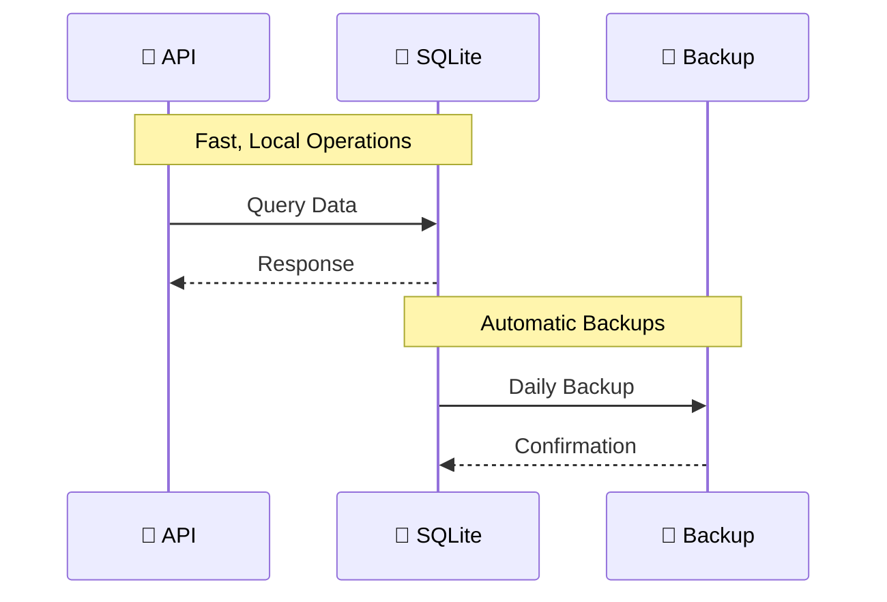

# 🏗️ NodeRoll Architecture

> 🎯 Simple yet powerful single-server deployment platform

## 🎯 Overview

NodeRoll Self-Hosted Standalone runs on a single server with three core components:

| Component | Description | Port |
|-----------|-------------|------|
| 🚀 **API Server** | Business logic & data operations | 3000 |
| 🎨 **UI Server** | Web interface | 3001 |
| 🛠️ **System Agent** | Server operations |  |

## 🧩 System Components

### 1. 🚀 API Server
The brain of NodeRoll, orchestrating all operations.

#### Key Features
- 🔐 GitHub OAuth integration
- 📦 Repository management
- 🚀 Deployment coordination
- 📊 System monitoring
- ⚡ Real-time updates

#### Technologies
- ⚙️ Node.js & Express
- 💾 SQLite with Sequelize
- 🔑 JWT auth
- 🔌 WebSocket

#### Data Storage
- 📁 Single SQLite file
- 🔄 Automatic backups
- 🔒 File-based security
- ⚡ Fast operations

### 2. 🎨 UI Server
Beautiful and intuitive interface for developers.

#### Features
- 🎯 Clean design
- ⚡ Real-time updates
- 🌓 Dark/Light modes
- 📱 Responsive layout

#### Technologies
- ⚛️ React
- 🎨 Tailwind CSS
- 🔌 WebSocket client
- 📊 Chart.js

### 3. 🛠️ System Agent
Powerful system-level operations manager.

#### Responsibilities
- 📦 Process management (PM2)
- 🔄 Nginx configuration
- 🔒 SSL management
- 📊 Metrics collection

## 🔄 Data Flow

### Deployment Process

### Database Operations

## 🔒 Security

### Authentication
- 🔑 GitHub OAuth
- 🎟️ JWT tokens
- 🔐 Secure sessions

### Data Security
- 📁 File-level permissions
- 🔒 SQLite encryption
- 🔑 Access control

### Network Security
- 🛡️ HTTPS only
- 🔒 SSL/TLS
- 🚫 Rate limiting

## 📊 Monitoring

### Metrics Collection
- 📈 System resources
- 🚦 Application health
- 🔍 Error tracking

### Logging
- 📝 Structured logs
- 🎯 Query tracing
- ⚡ Performance metrics

## 💾 Backup & Recovery

### Automated Backups
- 📁 Daily SQLite backups
- 🔄 Configuration backups
- 📦 Application state

### Recovery Process
- ⚡ Quick restore
- 🔄 Point-in-time recovery
- 🛡️ Data integrity checks

---

📚 [Back to Documentation](../README.md)

