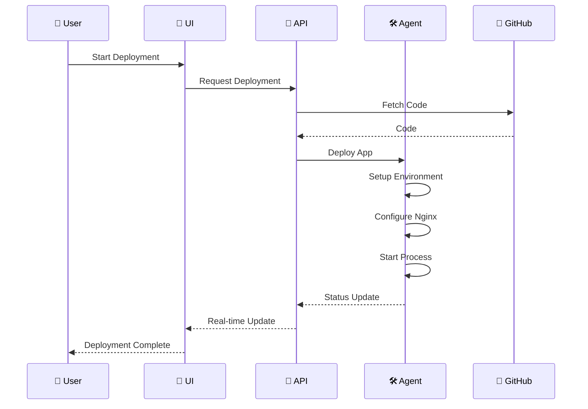
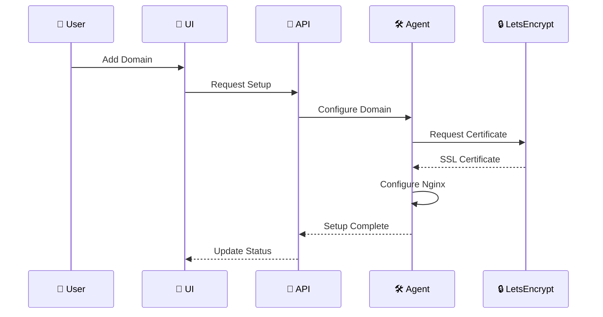

# 🏗️ NodeRoll Architecture

<div align="center">

> 🎯 Simple yet powerful single-server deployment platform

[]()
[]()
[]()

</div>

## 🎯 Overview

NodeRoll Self-Hosted Standalone runs on a single server with three core components:

| Component | Description | Port |
|-----------|-------------|------|
| 🚀 **API Server** | Business logic & data operations | 3000 |
| 🎨 **UI Server** | Web interface | 3001 |
| 🛠️ **System Agent** | Server operations |  |

## 🧩 System Components

### 1. 🚀 API Server
The brain of NodeRoll, orchestrating all operations.

#### Key Features
- 🔐 GitHub OAuth integration
- 📦 Repository management
- 🚀 Deployment coordination
- 📊 System monitoring
- ⚡ Real-time updates

#### Technologies
- ⚙️ Node.js & Express
- 🗄️ MongoDB
- 🔑 JWT auth
- 🔌 WebSocket

### 2. 🎨 UI Server
Beautiful and intuitive interface for developers.

#### Features
- 🎯 Clean design
- ⚡ Real-time updates
- 🌓 Dark/Light modes
- 📱 Responsive layout

#### Technologies
- ⚛️ React
- 🎨 Tailwind CSS
- 🔌 WebSocket client
- 📊 Chart.js

### 3. 🛠️ System Agent
Powerful system-level operations manager.

#### Responsibilities
- 📦 Process management (PM2)
- 🔄 Nginx configuration
- 🔒 SSL management
- 📊 Metrics collection

## 🔄 Data Flow

### Deployment Process


### SSL Setup Flow


## 📁 File Structure

```
/var/lib/noderoll/
├── 📦 apps/                  # Deployed applications
│   ├── app1/
│   │   ├── code/            # Application code
│   │   ├── logs/            # Application logs
│   │   └── .env             # Environment variables
│   └── app2/
├── 🔄 nginx/                 # Nginx configurations
│   ├── sites-available/
│   └── sites-enabled/
├── 🔒 ssl/                   # SSL certificates
│   ├── live/
│   └── archive/
├── 📝 logs/                  # System logs
└── 💾 backups/              # System backups
```

## 🔒 Security

### Process Isolation
- 👤 Per-app system users
- 📁 Limited file access
- 📊 Resource limits

### Network Security
- 🔒 Local-only services
- 🔄 Nginx reverse proxy
- 🔐 Auto SSL/TLS
- 🛡️ DDoS protection

## 📊 Monitoring

### Application Metrics
- 📈 Process status
- 💾 Memory usage
- 💻 CPU usage
- 🌐 Request metrics
- ❌ Error rates

### System Metrics
- 💽 Disk usage
- 🌐 Network traffic
- 🔒 SSL status
- 🔄 Nginx status

## 🎯 Single Server Focus

### Benefits
- 🎯 Simple setup
- 📦 Easy maintenance
- 🚀 Quick deployment
- 📊 Clear monitoring

### Considerations
- 📈 Resource management
- 🔒 Security focus
- 💾 Regular backups
- 📊 Performance monitoring

---

<div align="center">

Made with 💖 for developers who appreciate clean architecture

</div>
